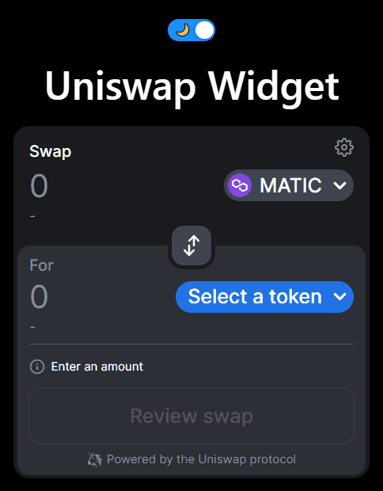

# Uniswap Widget

Uniswap Widget component with Dark Mode. Tests performed on Polygon but anything goes.



### Usage

Set your Ethereum-compatible node in `.env.development.local`

```
NEXT_PUBLIC_ETHEREUM_NODE=...
```

Start the thing

```bash
pnpm install
pnpm dev
```

Connect your MetaMask 🦊

Application should be available at https://localhost/3000